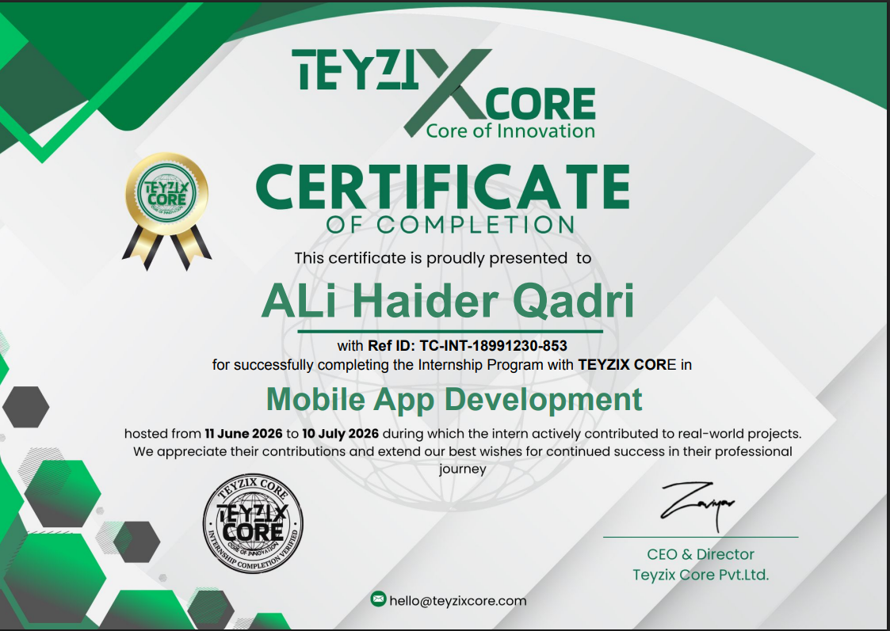
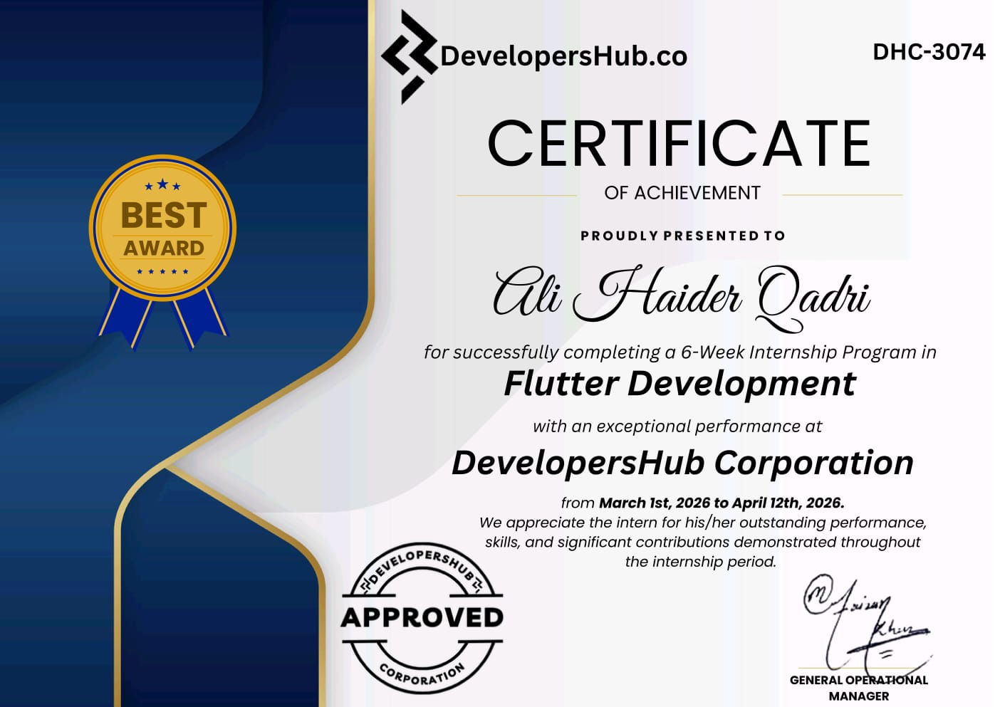

<p align="center">
  
</p>

<p align="center">
  
</p>

<p align="center">
  
  
</p>

<p align="center">
  <a href="https://portfolio-lilac-psi-22.vercel.app">
    
  </a>
  <a href="https://www.linkedin.com/in/ali-haider-2172823a7/">
    
  </a>
  <a href="mailto:hali49537@gmail.com">
    
  </a>
  <a href="https://github.com/Ali-123-c">
    
  </a>
</p>

<p align="center">
  
  
  
</p>

---
# 🚀 About Me

I'm **Ali Haider** — a Computer Science student and **Flutter developer** from Pakistan who turns ideas into real, shippable products. I build cross-platform mobile apps with **Dart / Flutter**, design **REST APIs** with **.NET Core**, and wire up cloud backends with **Firebase** and **Supabase**.

- 📱 **Mobile-first engineering** — clean Flutter architecture, Riverpod / Provider state management, offline-first storage
- ⚙️ **Full-stack depth** — .NET Core Web APIs, SQL Server, Next.js, Supabase (PostgreSQL)
- 🔐 **Security-minded** — Firebase Auth, biometric login, RowVersion concurrency, role-based access
- 🧩 **Product engineering mindset** — from database schema to polished UX, always built to ship

💼 **Open to** — internships, junior Flutter & full-stack roles, freelance work, and open-source collaboration.

---
# 🛠️ Tech Stack

### Languages

[](https://skillicons.dev)

### Frontend

[](https://skillicons.dev)

### Backend & Databases

[](https://skillicons.dev)

### Cloud, DevOps & Tooling

[](https://skillicons.dev)

---
# 🧠 AI / ML Expertise

| Domain | Proficiency | Details |
|--------|-------------|---------|
| Mobile Application Development | Expert | 10+ Flutter apps shipped across internships and university projects |
| Full-Stack Engineering | Advanced | .NET Core REST APIs, React / Next.js frontends, SQL databases |
| Cloud Backends & Auth | Advanced | Firebase Auth / Firestore / FCM, Supabase PostgreSQL + Auth |
| Data Structures & Algorithms | Intermediate | C++ problem solving across internship task series |
| Generative AI in Mobile Apps | Exploring | Integrating AI-powered features into mobile products |

---
# 📦 Featured Projects

<details>
<summary><b>🏫 Lost & Found Management System — University Capstone</b></summary>

A full-stack platform for managing lost and found items across a university campus — a **Flutter** mobile app backed by a **.NET Core Web API** built with Clean Architecture, an intelligent item-matching engine, an auction module for unclaimed items, and real-time notifications.

| Attribute | Detail |
|-----------|--------|
| **Stack** | Flutter · .NET Core · SQL Server · Clean Architecture |
| **Scale** | University-wide; user app + admin panel modules |
| **Performance** | Layered architecture with RowVersion concurrency tokens |
| **Security** | Role-based admin verification & secure REST endpoints |
| **Impact** | End-to-end capstone — from database schema to mobile UX |
| **Repository** | [View Code](https://github.com/Ali-123-c/LOST-AND-FOUND-APP-UNI-PROJECT) |

</details>

<details>
<summary><b>💰 Smart Expense Tracker — Personal Finance Manager</b></summary>

A modern Flutter finance app inspired by Money Manager & Spendee — expense and income tracking, monthly budgets with usage alerts, analytics dashboards, PDF report export, multi-currency support, dark mode, and offline-first storage.

| Attribute | Detail |
|-----------|--------|
| **Stack** | Flutter · Firebase Auth · Firestore · Hive · Provider |
| **Scale** | Personal finance; 8 currencies, 10 expense categories |
| **Performance** | Offline-first local storage (Hive) with Firestore sync |
| **Security** | Email / Google / biometric authentication, secure sessions |
| **Impact** | Flagship internship deliverable (TEYZIX MAD-1) |
| **Repository** | [View Code](https://github.com/Ali-123-c/FINANCE_APP) |

</details>

<details>
<summary><b>🔧 FieldOps — Field Service Management App</b></summary>

A field-service platform for technicians and managers — job assignment, status workflows, service reports, real-time notifications, and role-based dashboards built with Flutter and Supabase.

| Attribute | Detail |
|-----------|--------|
| **Stack** | Flutter · Riverpod · GoRouter · Supabase (PostgreSQL + Auth) |
| **Scale** | Technician + manager roles with real-time job workflows |
| **Performance** | Reactive state with Riverpod, real-time Supabase streams |
| **Security** | Supabase Auth (email/password), scoped role permissions |
| **Impact** | Production-style product ready for real field-ops teams |
| **Repository** | [View Code](https://github.com/Ali-123-c/-fieldops-app) |

</details>

<details>
<summary><b>🏋️ GymFlow — Gym Management System</b></summary>

A gym management system built with Next.js 15, TypeScript, Tailwind CSS, and Supabase — featuring fingerprint attendance tracking via USB device integration and live deployment on Vercel.

| Attribute | Detail |
|-----------|--------|
| **Stack** | Next.js 15 · TypeScript · Tailwind CSS · Supabase |
| **Scale** | Membership, attendance & fingerprint hardware integration |
| **Performance** | Server-rendered dashboards, fully typed end-to-end |
| **Security** | Supabase auth with schema-level access control |
| **Impact** | Live in production on Vercel |
| **Repository** | [View Code](https://github.com/Ali-123-c/RockHardGym) · [Live Demo](https://rock-hard-gym.vercel.app) |

</details>

<details>
<summary><b>🔔 Enhanced Task Manager — FCM Notifications</b></summary>

A premium Flutter task management app with Provider-based architecture, smooth UI animations, and full Firebase Cloud Messaging integration — foreground heads-up alerts plus background and terminated-state delivery with sound.

| Attribute | Detail |
|-----------|--------|
| **Stack** | Flutter · Provider · Firebase Cloud Messaging · SharedPreferences |
| **Scale** | Production-ready task CRUD with notification engine |
| **Performance** | Centralized Provider logic, animated, responsive UI |
| **Security** | Scoped notifications, secure session handling |
| **Impact** | Internship final project, polished to production quality |
| **Repository** | [View Code](https://github.com/Ali-123-c/FIP) |

</details>

<details>
<summary><b>📚 Flutter Internship Codebase — 6 Projects</b></summary>

A central repository of six completed Flutter internship projects — from login with form validation and state management to REST API integration, Firebase Auth + Firestore, and an FCM-powered advanced task manager.

| Attribute | Detail |
|-----------|--------|
| **Stack** | Flutter · Dart · http · Firebase Auth / Firestore · FCM |
| **Scale** | 6 projects across one learning track |
| **Performance** | Persistence with SharedPreferences & cloud sync |
| **Security** | Firebase authentication flows throughout |
| **Impact** | Complete internship portfolio in a single codebase |
| **Repository** | [View Code](https://github.com/Ali-123-c/complete_code) |

</details>

---
# 💼 Experience

### Flutter Developer Intern — TEYZIX
*2026*

Built the **Smart Expense Tracker** (MAD-1 task) — a full-featured finance app with email / Google / biometric authentication, expense & income tracking, budget planning with usage alerts, analytics dashboards, PDF report export, multi-currency support, dark mode, and offline-first storage with Firestore sync.

- Implemented secure auth flows (Firebase Auth + biometric unlock)
- Shipped analytics, budget alerts, and PDF export features
- Followed offline-first architecture (Hive → Firestore sync)

**Skills:** Flutter · Dart · Firebase · Hive · Provider

### Mobile App Development Intern — Flutter Program
*2026*

Delivered six internship projects in a single evolving codebase — from form validation and state management to REST API integration, Firebase Auth & Firestore, and FCM-powered task management with foreground and background notification support.

- Completed CRUD task managers with splash screens and persistence
- Integrated REST APIs using the `http` package
- Built a premium task manager with Provider and Firebase Cloud Messaging

**Skills:** Flutter · Dart · REST APIs · Firebase · FCM

### Programming Intern — C++
*2026*

Completed a series of C++ internship tasks hosted in a task hub — strengthening data structures, algorithms, and problem-solving fundamentals.

**Skills:** C++ · Data Structures & Algorithms

---
# 🏆 Achievements

<div align="center">

| Recognition | Details |
|-------------|---------|
| 🚀 Live Product Launches | Deployed a Flutter portfolio & a Next.js gym management system to Vercel |
| 📱 10+ Internship Deliverables | Flutter, .NET Core & C++ tasks completed across multiple programs |
| 🎓 University Capstone | Campus Lost & Found system — .NET Core Clean Architecture + Flutter |
| 📦 13 Public Repositories | Mobile, web & backend work shipped since 2024 |

</div>

---
# 📜 Certifications

<div align="center">

**TEYZIX CORE**

[](certificates/teyzix-core-mobile-app-development.png)

**DevelopersHub Corporation**

[](certificates/developershub-flutter-development.jpeg)

</div>

<details>
<summary><b>📜 TEYZIX CORE — Mobile App Development Internship</b></summary>
<br/>



**Certificate of Completion** · Ref ID `TC-INT-18991230-853` · 11 Jun – 10 Jul 2026

</details>

<details>
<summary><b>📜 DevelopersHub Corporation — Flutter Development Internship</b></summary>
<br/>



**Certificate of Achievement** · Cert ID `DHC-3074` · 6-Week Internship · 1 Mar – 12 Apr 2026

</details>

---
# 📊 GitHub Analytics

<div align="center">
  <a href="https://github.com/Ali-123-c">
    
  </a>
  <a href="https://github.com/Ali-123-c">
    
  </a>
  <br/>
  
</div>

---
# 🏅 GitHub Trophies

<p align="center">
  
</p>

---
# 📈 Contribution Activity

<p align="center">
  
</p>

---
# 🐍 Contribution Snake

<p align="center">
  
</p>

---
# 🎯 Current Focus

```yaml
learning:    [ Advanced Flutter & Riverpod, .NET Core Web APIs, Data Structures & Algorithms ]
building:    [ Smart Expense Tracker, Field Service Management, Personal Portfolio ]
exploring:   [ AI-powered mobile features, Cloud Platforms, Supabase at scale ]
open_to:     [ Internships, Junior Flutter & Full-Stack Roles, Open Source, Freelance ]
```

---
# 🔗 Connect With Me

<div align="center">

[](mailto:hali49537@gmail.com)

[](https://www.linkedin.com/in/ali-haider-2172823a7/)

[](https://github.com/Ali-123-c)

[](https://portfolio-lilac-psi-22.vercel.app)

[](https://www.instagram.com/alahaider5970)

</div>

---
> *"coding will never underestimate"* — Ali Haider

<p align="center">
  
</p>
